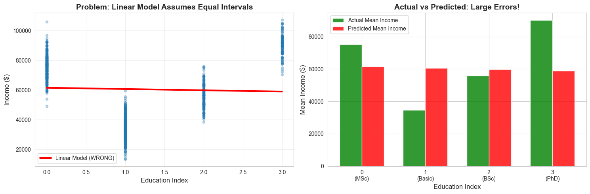
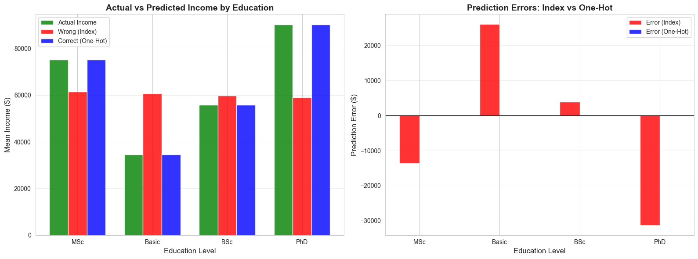

<!-- _class: lead -->

# Why One-Hot Encoding Matters

## The problem with using categorical indices as numerical features

**Core question:** “Why can’t we just use education index 0, 1, 2, 3 directly?”

---

# The short answer

The problem is not fractional predictions. The problem is that the model treats category indices as real numbers with order, distance, and linear meaning.

When we encode categories as `0, 1, 2, 3`, a linear model assumes:

- index 3 is “greater than” index 2
- the gap from 0 → 1 equals the gap from 2 → 3
- each one-step increase has the same effect on the target

---

# Synthetic example: education and income

Education levels were indexed by frequency, as tools like `StringIndexer` often do.

| Education | Index | Count | True average income |
|---|---:|---:|---:|
| MSc | 0 | 400 | $75,180 |
| Basic | 1 | 300 | $34,607 |
| BSc | 2 | 200 | $55,890 |
| PhD | 3 | 100 | $90,223 |

The index order does not match educational progression or income progression.

---

# Why the index is misleading

## Index order

0 → 1 → 2 → 3

MSc → Basic → BSc → PhD

## Real-world pattern

Basic < BSc < MSc < PhD

Income does not follow the index linearly.

The number is only a label, but the model reads it as measurement.

---

# Wrong approach: use index as a number

The linear model learns:

$$\text{Income} = 61{,}504.26 - 849.60 \times \text{EducationIndex}$$

**R² = 0.0016**

The model thinks each increase in index decreases income by $849.60, regardless of category.

---

# Wrong approach: predictions by category

| Education | Index | Actual mean | Predicted mean | Error |
|---|---:|---:|---:|---:|
| MSc | 0 | $75,180 | $61,504 | -$13,676 |
| Basic | 1 | $34,607 | $60,655 | +$26,048 |
| BSc | 2 | $55,890 | $59,805 | +$3,915 |
| PhD | 3 | $90,223 | $58,955 | -$31,268 |

The line is forced through categories that do not form a line.

---

# Visual: the index model fails

---

# The mathematical problem

Using the index creates the model:

$$\text{Income}=\beta_0+\beta_1\times\text{EducationIndex}$$

This forces one slope for all category transitions:

| Transition | Model assumption |
|---|---|
| MSc → Basic | same size effect as every other step |
| Basic → BSc | same size effect as every other step |
| BSc → PhD | same size effect as every other step |

That is a strong assumption — and here it is false.

---

# Right approach: one-hot encoding

One-hot encoding creates independent binary features.

| Education | Edu_Basic | Edu_MSc | Edu_PhD |
|---|---:|---:|---:|
| BSc | 0 | 0 | 0 |
| Basic | 1 | 0 | 0 |
| MSc | 0 | 1 | 0 |
| PhD | 0 | 0 | 1 |

**BSc is the reference category** in this example.

Now each category can have its own effect.

---

# Correct approach: one-hot model

**R² = 0.8614**

Model interpretation:

| Term | Meaning |
|---|---:|
| Base: BSc | $55,890 |
| Basic | $21,283 less than BSc |
| MSc | $19,290 more than BSc |
| PhD | $34,333 more than BSc |

The model is no longer forced to treat categories as equally spaced numbers.

---

# Wrong vs correct approach

| Education | Actual | Wrong: index | Correct: one-hot | Wrong error | Correct error |
|---|---:|---:|---:|---:|---:|
| MSc | $75,180 | $61,504 | $75,180 | -$13,676 | $0 |
| Basic | $34,607 | $60,655 | $34,607 | +$26,048 | $0 |
| BSc | $55,890 | $59,805 | $55,890 | +$3,915 | $0 |
| PhD | $90,223 | $58,955 | $90,223 | -$31,268 | $0 |

**Total absolute error:** index = **$74,907**; one-hot = **$0**.

---

# Visual: one-hot fixes the category effects

---

# Statistical model insight

Treating education as categorical gives:

| Metric | Result |
|---|---:|
| R² | 0.8614 |
| Adjusted R² | 0.861 |
| F-statistic | 2064 |
| F-statistic p-value | 0.00 |

Education is a highly significant predictor, but only when each category is allowed to have its own effect.

---

# Summary: why one-hot encoding is essential

## ❌ Index as number

- assumes ordering
- assumes equal intervals
- assumes linear effect
- loses category-specific effects

## ✅ One-hot encoding

- no false order
- each category independent
- captures non-linear category effects
- better predictions

One-hot encoding lets each category speak for itself.

---

# Connection to PySpark

In PySpark workflows:

1. **StringIndexer** converts labels into indices.
2. **OneHotEncoder** converts those indices into a usable categorical vector.

The index is an intermediate representation. It should not be used directly as a numeric feature for nominal categories.

Example final vector idea:

| Category | One-hot vector idea |
|---|---|
| MSc | [1, 0, 0] |
| Basic | [0, 1, 0] |
| BSc | [0, 0, 1] |
| PhD | [0, 0, 0] reference |

---

# Follow-up: “Why not order categories correctly?”

That only works when all three conditions are true:

1. there is an objective order
2. intervals between levels are meaningful and roughly equal
3. the relationship with the target is actually linear

Most categorical variables do not satisfy these assumptions.

---

# Ordinal vs nominal examples

| Variable | Better default treatment | Why |
|---|---|---|
| T-shirt size | ordinal or one-hot | has order, but effect may not be linear |
| Education level | often one-hot | order exists, intervals may not be equal |
| Marital status | one-hot | no natural numerical order |
| Country | one-hot | no natural numerical order |
| Product category | one-hot | nominal categories |
| Day of week | special/cyclical or one-hot | cyclic, not linear |

---

<!-- _class: lead -->

# Key takeaway

It is not about avoiding fractional predictions. It is about avoiding false mathematical structure.

**Use one-hot encoding unless you have strong evidence that order, distance, and linearity are all valid.**
